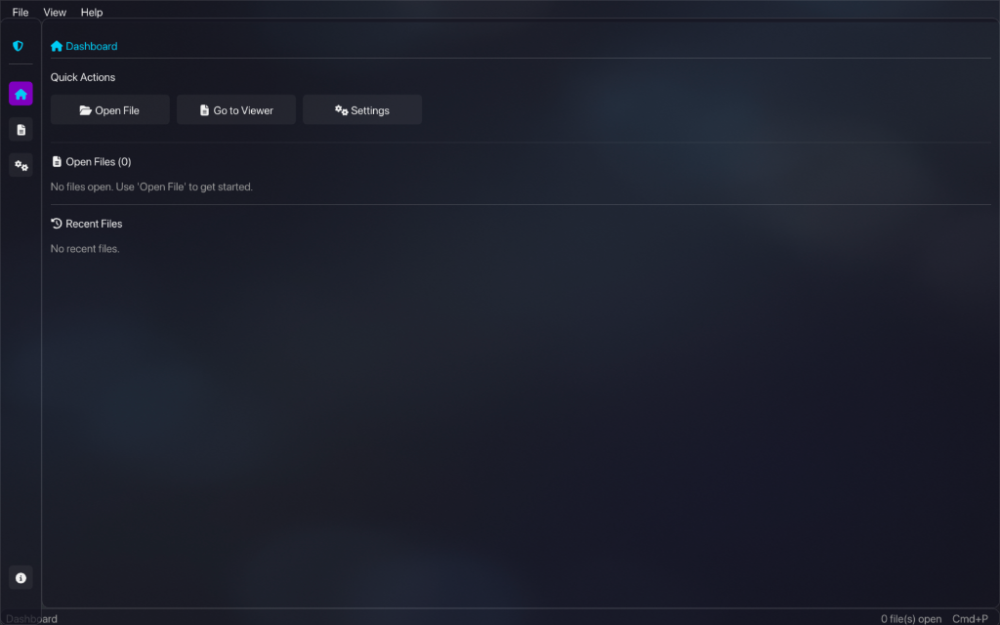

# 🚀 Modern C++ App Template (Glassmorphism)

Dit project is een **premium, neutrale C++ applicatie template** ontworpen voor ontwikkelaars die razendsnel moderne desktop applicaties willen bouwen met een verbluffende Glassmorphism UI. Het framework handelt de complexe window management, rendering en resource handling af, zodat jij je kunt focussen op de applicatie logica.


## 📸 Dashboard Preview


## ✨ Belangrijkste Features

### 💎 Premium GUI & UX
*   **Modern Glassmorphism**: Frosted glass effecten, vloeiende transities en High-DPI support.
*   **Multi-Page Navigatie**: Ingebouwde sidebar voor Dashboard, Viewer en Settings.
*   **Tab System**: Beheer meerdere documenten of views met een intuïtief tab-systeem.
*   **Menu Bar & Shortcuts**: Volledig functionele menu's en keyboard shortcuts (o.a. `Cmd+P`, `Cmd+O`, `Cmd+R`).
*   **Notification Center**: Geanimeerde "Toast" notificaties voor real-time feedback.

### 🛠 Developer Experience (DX)
*   **Event Bus**: Ontkoppel je componenten volledig met een type-safe event systeem.
*   **Action Registry**: Centraliseer alle applicatie-acties voor gebruik in menu's en de Command Palette.
*   **Command Palette**: Een razendsnel, doorzoekbaar menu voor power-users (als in VS Code of Slack).
*   **Semantic Themes**: Style je app met `ColorRole` (Accent, Surface, Success) in plaats van hardcoded kleuren.

### ⚙️ Architectuur
*   **Inversion of Control (IoC)**: Implementeer simpelweg de `IClientApp` interface.
*   **High-Performance**: Memory-mapped I/O support en async indexing.
*   **Cross-Platform**: Volledig CMake-gebaseerd voor macOS, Linux en Windows.

## 🚀 Snel Starten

### Vereisten
*   C++20 compliant compiler
*   CMake (3.14+)
*   GLFW & OpenGL 3.3+

### Bouwen & Uitvoeren
```bash
# Clone de repository
git clone https://github.com/parvenuprompting/cpp-project-starter.git
cd cpp-project-starter

# Configureer & Bouw
mkdir build && cd build
cmake ..
cmake --build .

# Start de Demo (Simple Viewer)
open examples/simple_viewer/simple_viewer.app  # macOS
./examples/simple_viewer/simple_viewer         # Linux/Windows
```

## 📦 Project Structuur
*   `framework/`: De kern (Window management, Theme, Core logic).
*   `examples/`: Voorbeeld applicaties (zoals de `simple_viewer`).
*   `resources/`: Assets (Fonts, Icons, Backgrounds, Demo images).
*   `external/`: Dependencies (ImGui, IconsFontAwesome6).

## 👥 Bijdragen
Dit project is een solide basis voor elke C++ tool. Voel je vrij om features toe te voegen aan het framework of extra voorbeelden te creëren!

## 📄 Licentie
MIT License - zie [LICENSE](LICENSE) voor details.
