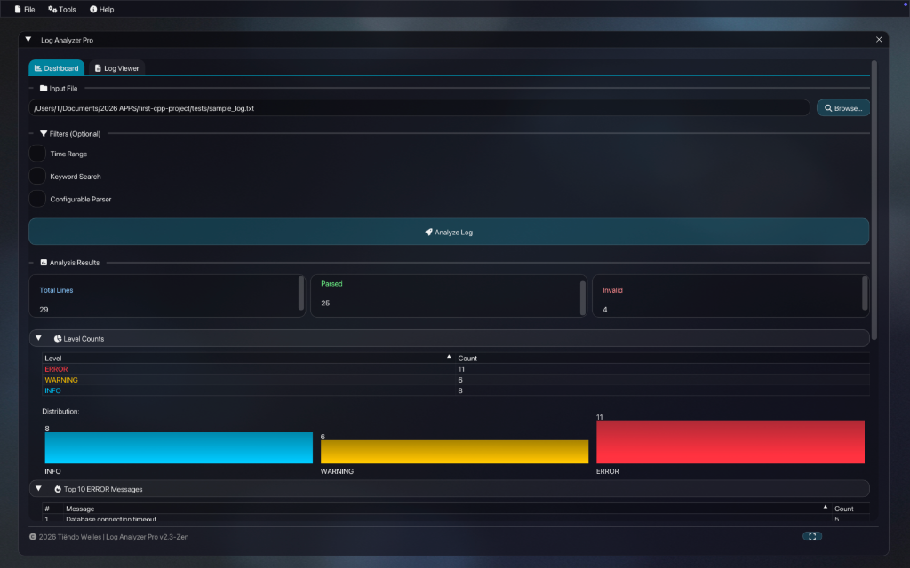

# 🚀 Modern C++ App Template (Glassmorphism)



Dit project is een **premium, neutrale C++ applicatie template** ontworpen voor ontwikkelaars die razendsnel moderne desktop applicaties willen bouwen met een verbluffende Glassmorphism UI. Het framework handelt de complexe window management, rendering en resource handling af, zodat jij je kunt focussen op de applicatie logica.


## ✨ Waarom deze Template?

*   **Premium Esthetiek**: Volledig geoptimaliseerde Glassmorphism interface met frosted glass effecten, vloeiende animaties en een rustgevend Ken Burns achtergrond-effect.
*   **Inversion of Control (IoC)**: Geen gedoe met main loops of GLFW initialisatie. Implementeer simpelweg de `IClientApp` interface en je bent klaar.
*   **High-Performance Core**: Ingebouwde support voor multi-threading, memory-mapped I/O en efficiënte resource management.
*   **Cross-Platform Ready**: Geconfigureerd met CMake voor macOS, Linux en Windows.
*   **Ready-to-use Components**: Inclusief moderne UI componenten zoals sidebars, premium cards, file pickers en geavanceerde datavisualisaties.

## 🏗 Architectuur

De template is strikt gescheiden in twee delen:
1.  **Modern Framework**: Een statische library (`modern_framework`) die alle engine logica bevat.
2.  **Client Application**: Jouw code die de `IClientApp` interface implementeert.

```cpp
// De enige code die je nodig hebt om te starten:
namespace framework {
    IClientApp* createClientApp() {
        return new MyCoolApp();
    }
}
```

## 🚀 Snel Starten

### Vereisten
*   C++20 compliant compiler
*   CMake (3.14+)
*   GLFW (voor GUI)
*   OpenGL 3.3+

### Bouwen & Uitvoeren
```bash
# Clone de repository
git clone https://github.com/parvenuprompting/cpp-project-starter.git
cd cpp-project-starter

# Configureer & Bouw
mkdir build && cd build
cmake ..
cmake --build .

# Start de Demo (Simple Viewer)
open examples/simple_viewer/simple_viewer.app  # macOS
./examples/simple_viewer/simple_viewer         # Linux/Windows
```

## 📦 Project Structuur
*   `framework/`: De kern van de engine (Window management, Theme, Utils).
*   `examples/`: Voorbeeld applicaties ter inspiratie (o.a. de Simple Viewer).
*   `resources/`: Assets zoals fonts (Font Awesome 6), icons en achtergronden.
*   `external/`: Externe dependencies zoals ImGui.

## 🎨 UI Features
*   **Zen Theme**: Geanimeerde achtergrond en vloeiende transities.
*   **Glass Controls**: Alle ImGui controls zijn gestyled met een modern frosty-glass uiterlijk.
*   **Vector Icons**: Volledige integratie van Font Awesome 6.
*   **Resource Manager**: Automatische pad-resolutie voor assets in bundles en development omgevingen.

## 👥 Bijdragen
Dit project is bedoeld als een solide basis voor diverse C++ tools. Voel je vrij om features toe te voegen aan het framework of extra voorbeelden te creëren!

## 📄 Licentie
MIT License - zie [LICENSE](LICENSE) voor details.
